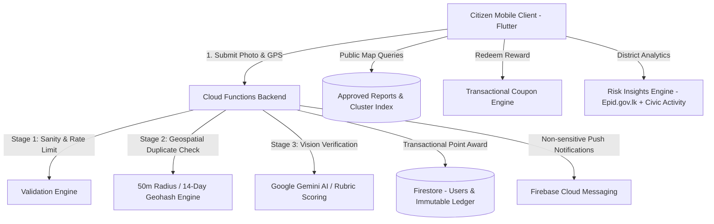

# CleanSpot — Community-Driven Dengue Breeding Site Mitigation, AI Verification & Civic Rewards

[](https://flutter.dev)
[](https://dart.dev)
[](https://firebase.google.com)
[](https://deepmind.google/technologies/gemini/)
[](LICENSE)

CleanSpot is a production-hardened mobile health and civic intelligence platform designed for dengue vector mitigation in Sri Lanka. It combines high-accuracy citizen geotagging, multimodal AI vision hazard verification, transactional civic reward incentives, interactive public hazard clustering maps, and district-level epidemiological risk intelligence.

---

## Table of Contents
1. [Core Features & Architecture](#core-features--architecture)
2. [Prerequisites & System Requirements](#prerequisites--system-requirements)
3. [Quick Installation](#quick-installation)
4. [Firebase Local Emulator Suite Setup](#firebase-local-emulator-suite-setup)
5. [Secrets & Environment Management](#secrets--environment-management)
6. [Deployment Guide](#deployment-guide)
7. [Android Build & Release Guide](#android-build--release-guide)
8. [Demonstration Guide & Screenshots](#demonstration-guide--screenshots)
9. [Privacy Notice & Data Protection](#privacy-notice--data-protection)
10. [Known Limitations](#known-limitations)
11. [Future Improvements](#future-improvements)
12. [Verification & Testing Commands](#verification--testing-commands)

---

## 1. Core Features & Architecture



- **3-Stage Authoritative Validation Pipeline**:
  - **Stage 1**: Enforces planetary GPS bounding, sensor accuracy thresholds ($\le 100\text{m}$), and rate-limiting ($\le 10\text{ reports/hour}$).
  - **Stage 2**: Server-side Geohash + Haversine distance engine detects duplicate reports within $50\text{m}$ and $14\text{ days}$. Converts duplicate reports into **Observations** earning **0 points**, eliminating point farming.
  - **Stage 3**: Multimodal vision verification via Google Gemini AI evaluating stagnant water, larvae risk, and discarded containers against structured Zod rubrics.
- **Authoritative Points & Financial Ledger**:
  - Points awarded exclusively via atomic Firestore transactions ($+50\text{ pts}$ on first verified report).
  - Every point change generates an append-only, immutable entry in `pointsTransactions`.
- **Public Live Hazard Map (`flutter_map`)**:
  - High-performance OpenStreetMap tile rendering with dynamic marker clustering.
  - Real-time category and date filtering.
  - Zero PII leak: Public hazard sheets strip all citizen identifiers.
- **Merchant Reward Shop & Redemptions**:
  - Atomic redemption callable verifying stock, active status, and point balances.
  - Secret coupon codes are protected by Firestore security rules and only readable by the redeeming user.
  - Idempotency keys prevent double debit during network retries.
- **District Risk Intelligence (`fl_chart`)**:
  - Combines official 52-week historical epidemiological case rates (source: Epid.gov.lk) with recent approved civic reports.
  - Calculates a normalized Composite Risk Index with weekly trend lines across all 26 Sri Lankan health districts.
  - Prominent experimental decision-support disclaimer.
- **Privacy-Safe FCM Notifications**:
  - Stored user preference switches (master + 4 categories).
  - Strict payload sanitization: zero PII, zero emails, zero coupon codes in push packets.
  - Full application functionality maintained if FCM is unavailable or unconfigured.

---

## 2. Prerequisites & System Requirements

Ensure the following tools are installed:
- **Flutter SDK**: `3.27+` or `3.13+` (`flutter --version`)
- **Dart SDK**: `3.6+` or `3.13+` (`dart --version`)
- **Node.js**: `v20.x` LTS (`node --version`)
- **Java Development Kit (JDK)**: JDK 11, 17, or 21 (required by Android Gradle and Firebase Emulator Suite)
- **Firebase CLI**: `firebase-tools v13+` / `v15+` (`npm install -g firebase-tools` or via `npx`)

---

## 3. Quick Installation

### 3.1 Clone Repository
```bash
git clone https://github.com/chathuranga00/Clean-Spot.git
cd Clean-Spot
```

### 3.2 Install Flutter Dependencies
```bash
flutter pub get
```

### 3.3 Install Backend Cloud Functions Dependencies
```bash
cd functions
npm install
cd ..
```

### 3.4 Install Root Test Dependencies (for Security Rules Testing)
```bash
npm install
```

---

## 4. Firebase Local Emulator Suite Setup

The repository is configured for full offline local development without incurring cloud costs or modifying production data.

### 4.1 Emulator Port Configuration
Defined in [`firebase.json`](file:///q:/MAD/Clean%20Spot%20Dengue/firebase.json):

| Service | Port | Description |
|---|---|---|
| **Emulator Web UI** | `4000` | Browser dashboard for inspecting Auth, Firestore, and Storage |
| **Authentication** | `9099` | Local JWT & user credential service |
| **Cloud Firestore** | `8088` | Local NoSQL database *(configured to 8088 to avoid port 8080 collisions)* |
| **Cloud Storage** | `9199` | Local blob bucket for report photos |
| **Cloud Functions** | `5001` | Serverless trigger runtime |

### 4.2 Start the Emulators
```bash
# Start all emulators
npx firebase-tools emulators:start
```
> Open **http://127.0.0.1:4000** in your browser to verify all services are active.

### 4.3 Seed Realistic Demo Data
In a second terminal, populate the emulator with test accounts, catalog rewards, and baseline hazard reports:
```bash
node functions/scripts/seed-emulator.js
```

**Pre-seeded Demo Credentials:**
- **Email:** `demo.citizen@cleanspot.app`
- **Password:** `Password123!`
- **Initial Civic Balance:** `350 pts`
- **Assigned District:** `Colombo`

### 4.4 Run the Flutter Application
The client includes [`FirebaseEmulatorManager`](file:///q:/MAD/Clean%20Spot%20Dengue/lib/src/core/network/firebase_emulator_manager.dart) which automatically routes debug traffic to local emulators:
- **Android Emulator**: Automatically routes to `10.0.2.2` (host bridge).
- **Chrome / Web / Desktop**: Routes to `localhost` / `127.0.0.1`.

```bash
# Run on Chrome
flutter run -d chrome

# Run on Android Emulator / Connected Device
flutter run -d android
```

---

## 5. Secrets & Environment Management

CleanSpot enforces a strict **Zero-Client-Secrets Policy**:

### 5.1 Client Secrets Protection
- Android (`android/app/google-services.json`), iOS (`ios/Runner/GoogleService-Info.plist`), and FlutterFire configurations (`lib/firebase_options.dart`) are client registration identifiers and are ignored in [`.gitignore`](file:///q:/MAD/Clean%20Spot%20Dengue/.gitignore).
- No API keys, secret tokens, or private credentials exist in the client binary.

### 5.2 Server-Side Secrets (Gemini AI Vision)
All vision model inference and API keys execute exclusively within server-side Cloud Functions:

#### Local Development (`functions/.env.local`)
Create `functions/.env.local` (already git-ignored):
```env
GEMINI_API_KEY=AIzaSyYourActualKeyHere
```

#### Production Secret Configuration
Set the secret in Google Cloud Secret Manager via Firebase CLI:
```bash
npx firebase-tools functions:secrets:set GEMINI_API_KEY
```

---

## 6. Deployment Guide

### 6.1 Compile Cloud Functions
```bash
npm --prefix functions run build
```

### 6.2 Deploy Cloud Functions
```bash
npx firebase-tools deploy --only functions
```

### 6.3 Deploy Security Rules & Composite Indexes
Deploy the hardened least-privilege security rules and multi-field query indexes:
```bash
npx firebase-tools deploy --only firestore:rules,firestore:indexes,storage
```

---

## 7. Android Build & Release Guide

### 7.1 Android Permissions
Configured in `android/app/src/main/AndroidManifest.xml`:
- `android.permission.INTERNET`: Firebase sync and tile retrieval.
- `android.permission.CAMERA`: Live breeding site capture.
- `android.permission.ACCESS_FINE_LOCATION` & `ACCESS_COARSE_LOCATION`: Sub-meter GPS geotagging.
- `android.permission.POST_NOTIFICATIONS`: Citizen status alerts (Android 13+).

### 7.2 Build Debug APK (For Emulator / Device Testing)
```bash
flutter build apk --debug
```
The compiled package is output to: `build/app/outputs/flutter-apk/app-debug.apk`.

> **Note for Windows Multi-Drive Environments:** If your workspace is on a secondary drive (e.g., `D:` or `Q:`) while pub cache is on `C:`, `kotlin.incremental=false` is pre-configured in `android/gradle.properties` to prevent cross-drive path mismatches during Gradle compilation.

### 7.3 Build Release APK
1. Create a release keystore:
   ```bash
   keytool -genkey -v -keystore android/upload-keystore.jks -keyalg RSA -keysize 2048 -validity 10000 -alias upload
   ```
2. Reference the keystore in `android/key.properties` (ignored in `.gitignore`).
3. Compile the production APK:
   ```bash
   flutter build apk --release
   ```
The optimized bundle is output to: `build/app/outputs/flutter-apk/app-release.apk`.

---

## 8. Demonstration Guide & Screenshots

A complete step-by-step presentation walkthrough with screenshot capture checkpoints is documented in:
👉 **[docs/demo-script.md](file:///q:/MAD/Clean%20Spot%20Dengue/docs/demo-script.md)**

### Key Demonstration Checkpoints:
1. **Onboarding Carousel & Sign In** (`01_onboarding_screen.png`, `02_login_screen.png`)
2. **Citizen Dashboard with Live Civic Balance** (`03_home_dashboard.png`)
3. **Breeding Spot Capture with Real-time GPS Accuracy Badge** (`04_report_form_gps.png`)
4. **Report Review & Double-Tap Submission Protection** (`05_report_review_submit.png`)
5. **AI Vision Approval & +50 Points Awarded** (`06_report_approved_points.png`)
6. **Geospatial Duplicate Detected as Observation (0 Points)** (`07_duplicate_observation.png`)
7. **Interactive Live Map with Marker Clustering & Details** (`08_live_hazard_map.png`)
8. **Reward Catalog & Secret Coupon Code Modal** (`09_reward_redemption_modal.png`)
9. **District Risk Insights & 52-Week Trend Chart** (`10_risk_insights_chart.png`)
10. **Privacy & Notification Preferences Settings** (`11_notification_settings.png`)

---

## 9. Privacy Notice & Data Protection

CleanSpot adheres to strict privacy-by-design principles:
1. **EXIF Metadata Stripping**:
   - Citizen report photos are stripped of device identity, camera serial numbers, and unverified metadata in memory before storage upload.
2. **Anonymous Public Hazard Map**:
   - The public map detail endpoint (`getPublicReportDetails`) returns only public hazard details (hazard category, photo, approximate location, status).
   - Citizen UID, display name, and email are **never** returned or queryable by third parties.
3. **Confidential Reward Coupons**:
   - Unredeemed coupon codes cannot be listed or read by any client.
   - Assigned coupon codes are strictly readable **only** by the specific citizen who redeemed the reward (`redeemedBy == request.auth.uid`).
4. **Zero-PII Push Payloads**:
   - FCM notification packets contain generic civic messages (e.g. *"Report Verified"*, *"Points Credited"*).
   - Payloads contain **zero** personal information, zero emails, and zero coupon codes.
5. **Immutable Financial Ledger**:
   - Points cannot be arbitrarily adjusted by clients or administrators without an immutable entry in the `pointsTransactions` collection.

---

## 10. Known Limitations

1. **Map Tile Rate Limits & Usage Policy**:
   - Standard OpenStreetMap raster tile servers enforce fair-use limits. In high-traffic production environments, configure a self-hosted tile caching proxy or commercial tile CDN (Mapbox/Google Maps).
2. **GPS Degradation in Indoor Environments**:
   - When device GPS accuracy exceeds $100\text{m}$ (e.g., inside deep structures), reports are rejected by Stage 1 validation. Users must move toward open sky to acquire acceptable satellite lock.
3. **Decision-Support Indicator Disclaimer**:
   - The District Risk Summary is an **experimental decision-support indicator** derived from historical case incidence and civic reporting density. It does not provide individual medical diagnosis or personal transmission guarantees.

---

## 11. Future Improvements

- **Offline Sync & Store-and-Forward**:
  - Implement a persistent SQLite/Hive offline submission queue that automatically syncs hazard reports when cellular coverage is restored in rural areas.
- **Automated Public Health Inspector (PHI) Dispatch**:
  - Real-time routing integration assigning verified high-risk clusters directly to local Medical Officers of Health (MOH) inspection teams.
- **Drone & High-Resolution Aerial Imagery Ingestion**:
  - Expand Stage 3 vision validation to support aerial drone surveys for roof gutter and high-altitude water reservoir detection.
- **Community Cleanup Event Coordination**:
  - Enable community-led cleanup campaigns where multiple citizens can verify hazard eradication and split communal reward pools.

---

## 12. Verification & Testing Commands

Every test command has been executed and verified in the CI/local test harness:

### 12.1 Flutter Unit & Widget Tests (50 Tests)
```bash
flutter test
```
*Executes all widget tests, GPS accuracy bounds, form validation, and end-to-end lifecycle flow.*

### 12.2 Backend Cloud Functions Tests (90 Tests)
```bash
cd functions
npm test
cd ..
```
*Validates Stage 1-3 validation, rate limiting, geospatial duplicate detection, points ledger idempotency, and coupon redemptions.*

### 12.3 Firestore Security Rules Tests (54 Tests)
```bash
# Run against the local Firestore Emulator
npx firebase-tools emulators:exec --only firestore --project demo-cleanspot "npm run test:rules"
```
*Proves users cannot approve reports, alter points, read others' data, read unused coupons, or bypass authentication.*

### 12.4 Static Analysis
```bash
# Flutter / Dart analysis
dart analyze

# TypeScript Cloud Functions build check
npm --prefix functions run build
```

---

## License
Distributed under the MIT License. See `LICENSE` for details. Built for public health awareness and community dengue mitigation in Sri Lanka.
