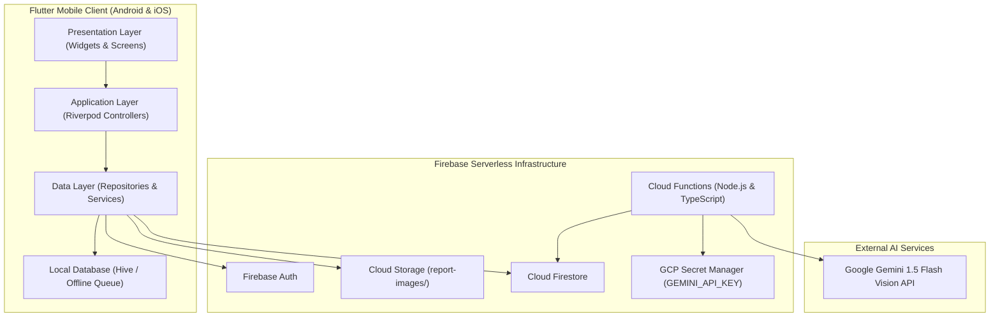
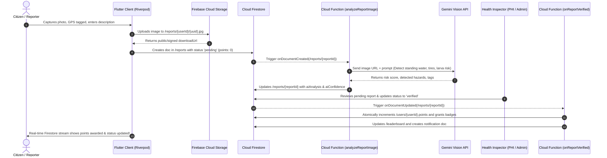
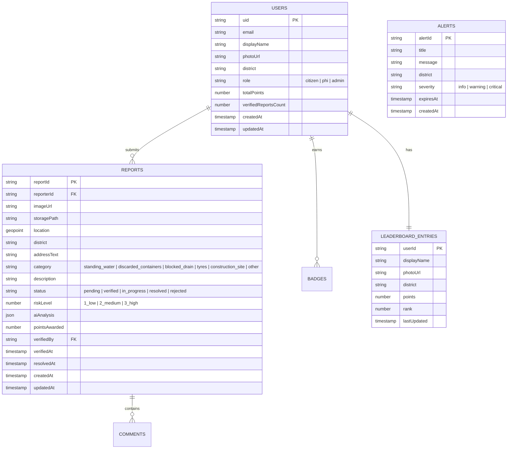
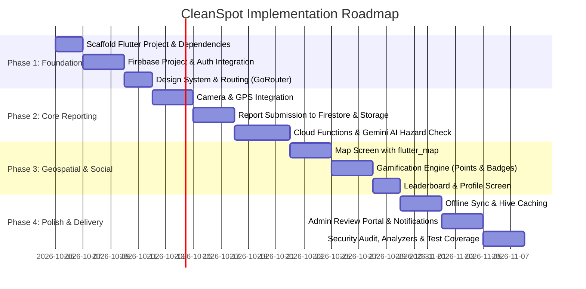

# CleanSpot System Architecture & Technical Specification

> **Phase 1 Planning Document**  
> Document Version: 1.0.0  
> Target Platform: Flutter (iOS & Android) with Firebase Serverless Backend  

---

## 1. System Assumptions & Core Technologies

| Layer / Concern | Technology Selection | Rationale / Architectural Decision |
| :--- | :--- | :--- |
| **State Management** | `flutter_riverpod` (v2.x with code generation) | Predictable, compile-safe, decoupled business logic, and testable dependency injection. |
| **Navigation & Routing** | `go_router` | Declarative routing, deep-linking support, and seamless authentication redirection guards. |
| **Map & Geospatial** | `flutter_map` + `latlong2` (OpenStreetMap / CartoDB) | Free, open-source tile rendering without leaking Google Maps API keys into client binaries. |
| **Backend & Database** | Firebase Cloud Firestore | Real-time listeners for reports, offline caching, and scalable NoSQL document storage. |
| **Authentication** | Firebase Authentication | Email/Password, Google Sign-In, and Anonymous guest access. |
| **Object Storage** | Firebase Cloud Storage | Secure photo storage for breeding site images with strict access rules. |
| **Backend Logic & AI** | Firebase Cloud Functions (Node.js/TypeScript) + Google Gemini API | Server-side image hazard detection (Gemini 1.5 Flash), automated risk scoring, and tamper-proof gamification point attribution. |
| **Local Persistence** | `hive_flutter` / `shared_preferences` | Local report draft persistence, offline sync queue, and user preferences. |

---

## 2. System Architecture & Data-Flow Diagrams

### 2.1 High-Level Architecture Diagram



### 2.2 End-to-End Report Submission & Verification Data-Flow



---

## 3. Screen Inventory & User Journeys

### 3.1 Screen Catalog

| Screen Identifier | Route Path | Description | Access Control |
| :--- | :--- | :--- | :--- |
| **SplashScreen** | `/splash` | App initialization, auth state resolution, theme preload | Public |
| **OnboardingScreen** | `/onboarding` | 3-step carousel explaining dengue reporting & rewards | First Launch |
| **LoginScreen** | `/login` | Email/Password login, Google Sign-In, link to register | Guest Only |
| **RegisterScreen** | `/register` | User signup with name, email, password, and home district | Guest Only |
| **HomeScreen** | `/home` | Dashboard: quick report button, nearby risk summary, daily tips | Authenticated |
| **MapScreen** | `/map` | Interactive map with report clusters, risk heat circles, filters | Authenticated |
| **NewReportScreen** | `/report/new` | Multi-step form: camera capture, GPS picker, category selector | Authenticated |
| **ReportDetailScreen** | `/report/:id` | Full details of a report, timeline (Submitted → Verified → Resolved) | Authenticated |
| **MyReportsScreen** | `/my-reports` | List of user's submitted reports with status filters | Authenticated |
| **LeaderboardScreen** | `/leaderboard` | Community rankings, top contributors, seasonal cleanup badges | Authenticated |
| **EducationalScreen** | `/education` | Dengue prevention guide, symptom checker, emergency contacts | Public/Auth |
| **ProfileScreen** | `/profile` | User stats, earned badges, notification settings, logout | Authenticated |
| **AdminReviewScreen** | `/admin/review` | PHI / Admin dashboard to verify or dismiss pending reports | Admin / PHI Only |

### 3.2 User Journeys

#### Journey A: Citizen Reports a Dengue Breeding Site
1. **Trigger**: User spots an open water barrel with larvae in their neighborhood.
2. **Action**: User opens CleanSpot and taps **"Report Spot"** on `HomeScreen`.
3. **Capture**: App opens camera, captures high-resolution photo, and grabs device GPS coordinates (`geolocator`).
4. **Detail Entry**: User selects hazard category (*"Water Storage / Uncovered Container"*), adds notes (*"Open tank behind community hall"*).
5. **Submission**: User taps **"Submit Report"**. The app writes image to Cloud Storage and document to Firestore with status `pending`.
6. **Background AI Check**: Cloud Function analyzes image via Gemini Vision. AI tags are attached to the report.
7. **Verification & Reward**: Once a health officer or automated threshold verifies the spot, points (+50 pts) are awarded via Cloud Function. User receives a push notification and badge progress.

#### Journey B: Citizen Explores Community Dengue Heatmap
1. **Trigger**: User wants to see if their neighbourhood is at risk after heavy monsoon rains.
2. **Action**: User navigates to `MapScreen`.
3. **Visualization**: Map renders pins color-coded by severity:
   - 🔴 **Red**: Verified High Risk (Active breeding larvae)
   - 🟡 **Yellow**: Pending Inspection / Medium Risk (Stagnant water)
   - 🟢 **Green**: Resolved / Cleaned site
4. **Interaction**: User taps a cluster or marker to open a bottom sheet showing summary, distance, and date reported.

#### Journey C: Health Inspector (PHI) Validates & Dispatches Cleanup
1. **Action**: Health Inspector logs in with official PHI credentials.
2. **Queue Inspection**: Navigates to `/admin/review` to see incoming `pending` reports sorted by AI risk score and proximity.
3. **Decision**: Inspector reviews the photo, location, and Gemini hazard assessment. Taps **"Verify & Dispatch Cleanup"**.
4. **Execution**: Status changes to `verified`. The Cloud Function triggers point distribution to the reporter. When cleanup is completed, status moves to `resolved`.

---

## 4. Detailed Firestore Data Schema



### 4.1 Collection Specifications

#### 1. `users/{userId}`
```json
{
  "uid": "usr_948194829",
  "email": "citizen@example.com",
  "displayName": "Kamal Perera",
  "photoUrl": "https://storage.googleapis.com/.../avatar.jpg",
  "district": "Colombo",
  "role": "citizen", // "citizen" | "phi" | "admin"
  "totalPoints": 250,
  "verifiedReportsCount": 5,
  "badges": ["first_spotter", "community_guardian"],
  "fcmToken": "dKjs9...",
  "createdAt": "2026-10-04T02:00:00Z",
  "updatedAt": "2026-10-04T02:00:00Z"
}
```

#### 2. `reports/{reportId}`
```json
{
  "reportId": "rep_102938475",
  "reporterId": "usr_948194829",
  "reporterName": "Kamal Perera",
  "imageUrl": "https://firebasestorage.googleapis.com/.../rep_102938475.jpg",
  "storagePath": "reports/usr_948194829/rep_102938475.jpg",
  "location": {
    "_latitude": 6.9271,
    "_longitude": 79.8612
  },
  "geohash": "tc13p4",
  "district": "Colombo",
  "addressText": "Near 3rd Lane, Narahenpita",
  "category": "standing_water",
  "description": "Uncovered rain barrel with visible mosquito larvae.",
  "status": "pending", // "pending" | "verified" | "in_progress" | "resolved" | "rejected"
  "riskLevel": 3,      // 1 (Low), 2 (Medium), 3 (High)
  "aiAnalysis": {
    "isDengueRisk": true,
    "confidence": 0.94,
    "detectedHazards": ["standing_water", "open_container", "organic_debris"],
    "summary": "Clear evidence of stagnant rainwater in an open black plastic barrel.",
    "processedAt": "2026-10-04T02:01:00Z"
  },
  "pointsAwarded": 0,  // strictly controlled by Cloud Functions
  "verifiedBy": null,
  "verifiedAt": null,
  "resolvedAt": null,
  "createdAt": "2026-10-04T02:00:00Z",
  "updatedAt": "2026-10-04T02:01:00Z"
}
```

#### 3. `leaderboard/{userId}`
```json
{
  "userId": "usr_948194829",
  "displayName": "Kamal Perera",
  "photoUrl": "https://storage.googleapis.com/.../avatar.jpg",
  "district": "Colombo",
  "totalPoints": 250,
  "rank": 4,
  "updatedAt": "2026-10-04T02:05:00Z"
}
```

---

## 5. Firebase Services & Setup Configuration

### 5.1 Required Services
1. **Firebase Authentication**: Email/Password + Google Provider.
2. **Cloud Firestore**: Native mode database with location indexes.
3. **Cloud Storage**: Bucket path `/reports/{userId}/{reportId}.jpg`.
4. **Cloud Functions (2nd Gen)**: Node.js 20 or 22 runtime for background triggers and Callable APIs.
5. **GCP Secret Manager**: Secure storage for `GEMINI_API_KEY`.
6. **Firebase Cloud Messaging (FCM)**: Push notifications for status changes and dengue hazard alerts.

### 5.2 Security Rules Strategy

#### Firestore Security Rules (`firestore.rules`)
```javascript
rules_version = '2';
service cloud.firestore {
  match /databases/{database}/documents {
    
    function isAuthenticated() {
      return request.auth != null;
    }
    function isOwner(userId) {
      return isAuthenticated() && request.auth.uid == userId;
    }
    function isAdmin() {
      return isAuthenticated() && request.auth.token.role in ['admin', 'phi'];
    }

    // User profiles
    match /users/{userId} {
      allow read: if isAuthenticated();
      // Users can update basic profile info, but NEVER points, role, or badges directly
      allow create: if isOwner(userId) && !('totalPoints' in request.resource.data) && !('role' in request.resource.data);
      allow update: if isOwner(userId) 
                    && !request.resource.data.diff(resource.data).affectedKeys().hasAny(['totalPoints', 'role', 'badges', 'verifiedReportsCount']);
      allow write: if isAdmin();
    }

    // Breeding site reports
    match /reports/{reportId} {
      allow read: if isAuthenticated();
      // Reporters can create pending reports with initial points 0
      allow create: if isAuthenticated() 
                    && request.resource.data.reporterId == request.auth.uid
                    && request.resource.data.status == 'pending'
                    && request.resource.data.pointsAwarded == 0;
      // Normal users CANNOT approve, change status, or award points
      allow update: if isAdmin();
      allow delete: if isAdmin();
    }

    // Leaderboard (read-only for clients, managed by Cloud Functions)
    match /leaderboard/{userId} {
      allow read: if isAuthenticated();
      allow write: if false; // Cloud Functions only
    }

    // Public Alerts
    match /alerts/{alertId} {
      allow read: if isAuthenticated();
      allow write: if isAdmin();
    }
  }
}
```

#### Storage Security Rules (`storage.rules`)
```javascript
rules_version = '2';
service firebase.storage {
  match /b/{bucket}/o {
    match /reports/{userId}/{fileName} {
      allow read: if request.auth != null;
      allow write: if request.auth != null 
                   && request.auth.uid == userId
                   && request.resource.size < 10 * 1024 * 1024 // Max 10MB
                   && request.resource.contentType.matches('image/(jpeg|png|webp)');
    }
  }
}
```

---

## 6. Directory Structure (Feature-First)

### 6.1 Flutter Mobile App Structure (`lib/`)

```
lib/
├── main.dart
├── src/
│   ├── app.dart                                # MaterialApp.router setup
│   ├── core/                                   # Cross-cutting foundational modules
│   │   ├── constants/                          # App constants, asset paths, keys
│   │   ├── errors/                             # Failure classes & exception handlers
│   │   ├── network/                            # Network client / connectivity checks
│   │   ├── router/                             # GoRouter configuration & route paths
│   │   ├── theme/                              # Color schemes, typography, styles
│   │   └── utils/                              # Formatters, location helpers, validators
│   │
│   └── features/                               # Feature-First Architecture
│       ├── auth/                               # Authentication & User Sessions
│       │   ├── data/                           # FirebaseAuthRepository
│       │   ├── domain/                         # UserModel, AuthState
│       │   ├── application/                    # AuthController, AuthService
│       │   └── presentation/                   # LoginScreen, RegisterScreen, OnboardingScreen
│       │
│       ├── reports/                            # Breeding Site Reporting & List
│       │   ├── data/                           # FirestoreReportRepository, StorageRepository
│       │   ├── domain/                         # ReportModel, HazardCategory, ReportStatus
│       │   ├── application/                    # ReportSubmissionController, MyReportsNotifier
│       │   └── presentation/                   # NewReportScreen, ReportDetailScreen, MyReportsScreen
│       │
│       ├── map/                                # Hotspot Map & Geospatial View
│       │   ├── data/                           # MapTileRepository, HotspotRepository
│       │   ├── domain/                         # HotspotCluster, GeoPointModel
│       │   ├── application/                    # MapFilterController, LocationNotifier
│       │   └── presentation/                   # MapScreen, widgets/ReportBottomSheet
│       │
│       ├── gamification/                       # Points, Badges & Leaderboard
│       │   ├── data/                           # LeaderboardRepository
│       │   ├── domain/                         # LeaderboardEntry, BadgeModel
│       │   ├── application/                    # LeaderboardController, UserStatsNotifier
│       │   └── presentation/                   # LeaderboardScreen, widgets/BadgeGrid
│       │
│       ├── education/                          # Dengue Prevention & Awareness
│       │   ├── data/                           # PreventionTipsData
│       │   ├── domain/                         # TipArticleModel
│       │   └── presentation/                   # EducationalScreen, SymptomCheckerScreen
│       │
│       └── profile/                            # User Account & Settings
│           ├── application/                    # ProfileController
│           └── presentation/                   # ProfileScreen, EditProfileDialog
```

### 6.2 Firebase Cloud Functions Structure (`functions/`)

```
functions/
├── package.json
├── tsconfig.json
├── .env.example                                # Documented required secrets & config
├── src/
│   ├── index.ts                                # Main exports for Cloud Functions
│   ├── config/
│   │   └── firebase.ts                         # Admin SDK initialization
│   ├── services/
│   │   ├── gemini.service.ts                   # Gemini Vision API client (using Secret Manager)
│   │   └── notification.service.ts             # FCM push notification dispatcher
│   └── triggers/
│       ├── onReportCreated.ts                  # Triggers AI image analysis upon new report
│       ├── onReportStatusUpdated.ts            # Awards points & updates leaderboard on verification
│       └── scheduledHotspotAggregator.ts       # Nightly geohash aggregation for heatmaps
```

---

## 7. Environment Variables & Credentials Management

> [!CAUTION]
> **Zero Client Secret Rule**: Absolutely NO Gemini API keys, Service Account JSONs, or database admin credentials shall ever be placed in Flutter code or committed to Git.

### 7.1 Client-Side (Flutter App)
Client-side credentials are restricted configuration files automatically mapped to application bundle IDs:
- **Android**: `android/app/google-services.json` (Ignored in `.gitignore`)
- **iOS**: `ios/Runner/GoogleService-Info.plist` (Ignored in `.gitignore`)
- **Public Config / Flavors**:
  - `APP_ENV`: `development` | `staging` | `production`
  - Tile Provider URL Template: e.g. OpenStreetMap tile endpoint (`https://tile.openstreetmap.org/{z}/{x}/{y}.png`)

### 7.2 Backend Cloud Functions (Server-Side Secrets)
Managed via **Google Cloud Secret Manager** and accessed securely in Firebase Functions:
- `GEMINI_API_KEY`: API Key for Google Gemini 1.5/2.0 Flash Vision.
- `FIREBASE_CONFIG`: Handled automatically by Firebase runtime.

```bash
# Setting secret in Firebase Functions CLI
firebase functions:secrets:set GEMINI_API_KEY
```

---

## 8. Implementation Order & Milestone Plan



### Detailed Milestone Tasks
1. **Milestone 1 — Flutter & Firebase Foundation**
   - Initialize Flutter project with bundle IDs (`com.cleanspot.app`).
   - Configure dependencies (`flutter_riverpod`, `go_router`, `firebase_core`, `firebase_auth`, `cloud_firestore`, `firebase_storage`).
   - Establish App Theme (Health Teal `#00897B`, Alert Amber `#FFB300`, Hazard Red `#E53935`, Dark Charcoal `#1E293B`).
   - Setup GoRouter with redirect guards checking `AuthState`.

2. **Milestone 2 — Reporting Pipeline (Camera, GPS, Storage)**
   - Build `NewReportScreen` with photo capture (`image_picker` / `camera`) and live GPS coordinate capture (`geolocator`).
   - Implement `FirestoreReportRepository` with optimistic local states.
   - Deploy `onReportCreated` Cloud Function to analyze photo using Gemini 1.5 Flash Vision.

3. **Milestone 3 — Interactive Map & Hotspot Exploration**
   - Integrate `flutter_map` with cached network tile provider.
   - Stream active reports from Firestore filtered by district and bounding box.
   - Implement bottom sheet modal for inspected markers.

4. **Milestone 4 — Server-Side Gamification & Authority**
   - Implement `onReportStatusUpdated` Cloud Function to award points only upon inspector verification.
   - Build `LeaderboardScreen` with real-time top contributor rankings.
   - Add user achievements and notification triggers.

5. **Milestone 5 — Verification, Tests & Final Review**
   - Implement unit and widget tests for Riverpod controllers.
   - Run `flutter analyze` and `flutter test` to ensure zero warnings.
   - Perform end-to-end verification of offline queue and security rules.

---

## 9. Optional FCM Notifications & Privacy Architecture

### 9.1 Overview & Design Principles
Push notifications in CleanSpot inform citizens of critical community defense actions:
1. **Report Approved (`approved`)**: Verification that a reported hazard has been reviewed and added to the community map.
2. **Report Rejected (`rejected`)**: Clear feedback if an image is indecipherable or ineligible, allowing the citizen to review.
3. **Points Awarded (`points`)**: Instant notification when civic points are credited to the user's ledger.
4. **Coupon Redeemed (`coupon_redeemed`)**: Confirmation when reward coupons are claimed.

### 9.2 Privacy & Zero-Sensitive-Data Guarantee
To protect citizen privacy and comply with strict security standards:
- **No PII**: Names, email addresses, phone numbers, and reporter identities are **strictly excluded** from push titles, bodies, and data payloads.
- **No Secret Coupon Codes**: Redemption push messages contain only non-sensitive metadata (e.g. `rewardId`, `rewardTitle`). Real coupon codes are **NEVER transmitted in push payloads**; they are exclusively accessible within the authenticated app under the user's private profile.
- **Data Payload Schema**: All custom data entries are strictly non-sensitive key-value pairs (e.g., `{ type: 'points_awarded', points: '50' }`).

### 9.3 User Stored Preferences
Preferences are stored in Firestore under `users/{userId}.notificationPreferences`:
```json
{
  "enabled": true,
  "reportApproved": true,
  "reportRejected": true,
  "pointsAwarded": true,
  "couponRedeemed": true
}
```
- **Master Switch (`enabled`)**: When toggled off, all notification delivery is suppressed regardless of granular settings.
- **Category Toggles**: Citizens can customize notifications per event type from the in-app Settings screen.

### 9.4 Graceful Degradation & Unconfigured FCM Behavior
- **Zero Hard Dependency**: CleanSpot functions completely normally if FCM is not configured, tokens are absent, or push services are disabled.
- **Settings Screen Status Indicator**: Transparently shows active status when FCM is connected, or "FCM Not Configured (Offline / Local Mode)" with a reassurance that all app features remain fully operational.
- **Server-Side Resilience**: Notification failures or missing FCM credentials in Cloud Functions are caught safely with non-fatal logging and never abort core transactional workflows (e.g., point awarding or reward redemption).
- **Token Maintenance**: Unregistered or invalid tokens (`messaging/registration-token-not-registered`) are pruned automatically from `users/{userId}.fcmTokens`.

